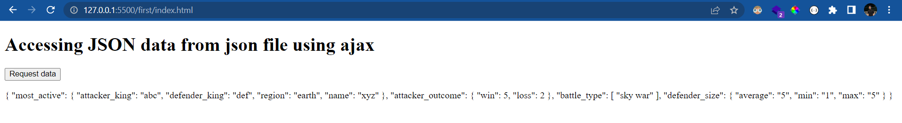
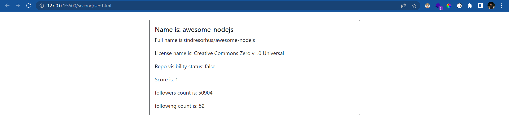
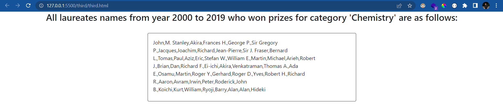
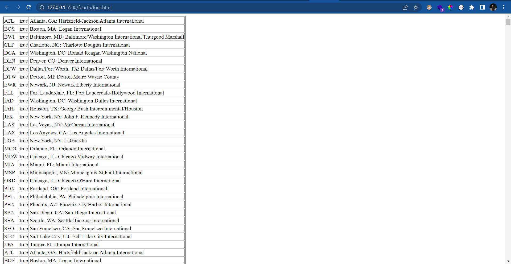

## Task 1:

- Get battles.json via. AJAX call
##### output:

## Task 2:

-  Use the following API to find the repository from git using git search API using ajax.Consider input as the search parameter.Try to solve this problem in promise , async await and callbacks Visit this api to know moreI : https://developer.github.com/v3/search/
##### output:

## Task 3:

- API: http://api.nobelprize.org/v1/prize.json ->
Solve the following problem using async-await and promise (.then .catch)
Use array methods
Fetch all data from API and find all the entries from year 2000 to 2019 and then find people who won prizes for category 'Chemistry'.

##### output:

## Task 4:

- API: https://think.cs.vt.edu/corgis/datasets/json/airlines/airlines.json
Solve the following problem using async-await and promise (.then .catch)
Use array methods
Fetch all data from API and find all the cancelled, delayed, diverted, on time flights for all airports from API 2 and check if the sum is equal to the total value.

##### output:
